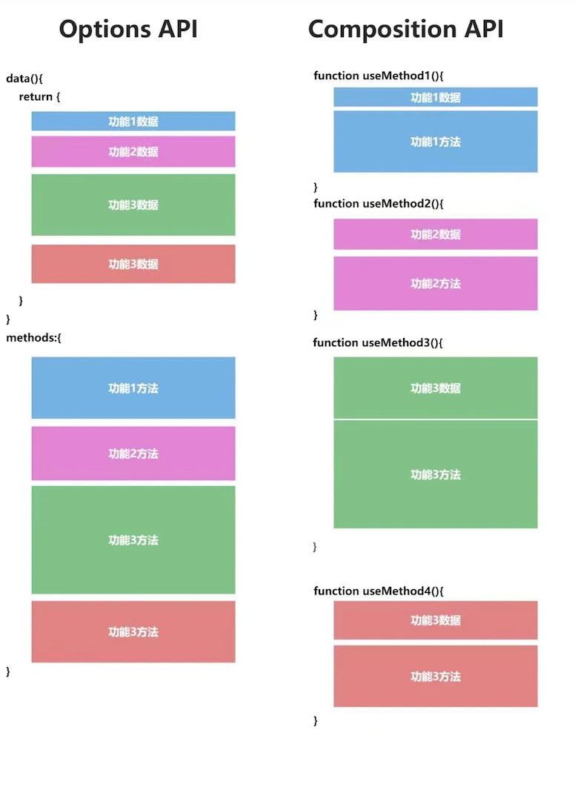

# vue2 升级

## 为什么要升级

vue2 将在年底停止维护,未来可能会出现一些问题(https://v2.cn.vuejs.org/lts/index.html)

- 安全与合规

```
  软件在终止支持之后通常不会修复新的安全问题。Vue 2 在过去尚未有过真正的安全问题的记录，但是你可能会需要一个版本来应对合规或公司政策问题。
  如果你在向客户提供带有服务级别协议 (SLA：Service Level Agreement) 的应用，你需要在技术栈中避免使用终止支持的软件。
  浏览器有时会发布一些会破坏老旧库的变更。这样的情况极少发生，但理论上难以完全避免。
```

- 技术角度

```
  从技术角度看，Vue 2 是一项稳定且实战考验过的技术。如果它现在可以很好地支持你的工作，我们相信在可预见的未来仍然如此。
  此外，我们也已经把大部分 Vue 3 重要的特性移植回了 Vue 2.7，包括组合式 API 和 <script setup>。这使得 Vue 2的项目可以提升其可扩展性、充分利用生态系统中最新的库、以及为潜在的 Vue 3 升级机会做更好的准备。
  Vue 2.7 也是在终止支持之前保持维护的版本，所以如果你打算留在 Vue 2，应该至少升级至 2.7。
```

## vue3 有哪些优点？

### 性能提升，运行速度是 vue2 的 1.5 倍

```
Vue.js 3采用了新的基于Proxy的响应式系统，使观察者不再需要为每个属性都创建一个getter/setter方法，进而提高了响应式系统的性能表现。此外，组件的渲染性能也得到了大幅提升，更快的速度可以带来更好的用户体验。 Vue.js 3还通过静态树提升和hoist static提升技术来进一步优化和加速组件的渲染速度。
```

### 体积更小，按需编译体积 vue2 要更小，减少了 40%

```
移除不必要的代码。Vue3将vue.js拆分成多个文件进行管理，并对代码进行精简，从而进一步缩减了项目体积。
优化编译器。Vue3编译器从运行时中独立出来，使得代码更好地压缩。此外，再加上ES模块、Tree Shaking以及动态Import等优化策略的应用，打包效率大为提升，大小进一步减小。
改进创建VNode的API。Vue3中采用了创建虚拟DOM节点的新方式，重新设计了渲染函数的API，从而使编译出来的代码更少并且可以具有更高的性能。
```

### 类型推断，更好的支持 ts 这个也是趋势新的特新

```
开发者在使用TypeScript时可以获得更好的静态类型检查和开发工具支持。TypeScript支持使得代码在被编辑器和IDE分析和检查时会更具可读性和可维护性。
```

### 高级给予，暴露了更底层的 API 和提供更先进的内置组件(https://cn.vuejs.org/api/)

- ref 和 reactive

```js
ref 是把值类型添加一层包装，使其变成响应式的引用类型的值。reactive 则是引用类型的值变成响应式的值。
vue2 中虽然实现了数据的「响应式」，但 Vue 不能检测数组和对象的变化(对象直接新添加的属性或删除已有属性, 界面不会自动更新.直接通过下标替换数组元素或更新 length, 界面不会自动更新)。

var vm = new Vue({
  data:{
    a:1
  }
})

// `vm.a` 是响应式的

vm.b = 2
// `vm.b` 是非响应式的

var vm = new Vue({
  data: {
    items: ['a', 'b', 'c']
  }
})
vm.items[1] = 'x' // 不是响应性的
vm.items.length = 2 // 不是响应性的
```

- 支持监听多个源

```js
在Vue3里，watch多了一个特性，可以传入一个数组同时侦听多个数据，这比起Vue2确实优雅多了，以往在Vue2中为了实现同时监听多个数据，往往需要借助computed，现在在Vue3里我们可以少一些不必要的代码了。
const name = ref<string>('张三')
const userInfo = reactive({
age: 18
})
// 同时监听 name 和 userInfo 的 age 属性
watch([name, () => userInfo.age], ([newName, newAge], [oldName, oldAge]) => {
//
})
```

- Custom Renderer API

```
创建一个自定义渲染器。通过提供平台特定的节点创建以及更改 API，你可以在非 DOM 环境中也享受到 Vue 核心运行时的特性（以往解决把 vue 的开发模型扩展到其他平台(Canvas、iOS、Android等等)的方式之一是借助第三方工具）
```

- Fragment

```
在 vue2 中，每个模板必须有一个根节点，否则就会报错。vue3 中可以不需要根节点，多个元素或标签可并列存在。
```

- Teleport

```
传送门。可以把 teleport 中的内容添加到任意的节点内，对于嵌套较深的组件来说绝对是一个福音。
```

- Supense

```
允许程序在等待异步组件渲染一些后备的内容，可以让我们创建一个平滑的用户体验。
```

### 组合 API，能够更好的组织逻辑，封装逻辑，复用逻辑。更好的可读性和可维护性



<!-- ## vue2 升级到 vue3 的难点

```
项目体量大，升级所需要投入的人力，时间比较多
需要升级对应版本的插件，插件需要做适配型改造
学习成本
过程中可能会有不确定因素，导致升级不顺畅
``` -->

## 升级的几种方式

### 全面升级

将系统直接升级到 vue3.0（https://v3-migration.vuejs.org/zh/migration-build.html），以下以专区升级改造为列：

- vue 代码变更

```js
main.js改造，适配vue3
子传父的emit,不能用 change 命名
Img 元素，不能直接写宽高，需要写在style里面
组件引用方式，需要导入，并且在components中注册
```

- 构建工具升级

```js
vue-loader 升级至 ^16.0.0
vue-cli升级
vue升级
添加@vue/compat
将vue-template-compiler替换为 @vue/compiler-sfc。为 vue 设置别名 @vue/compat，且通过 Vue 编译器选项开启兼容模式

```

- vuex 升级 4.0.0

```js
// package.json
{
  - "vuex": "^3.0.0",
  + "vuex": "^4.0.0",
  - "vue": "2.6.14",
  + "vue": "^3.1.0",
}
//src/store/index.js
需要做对应改造
```

- 2.router 升级 4.0.0

```js
// package.json
{
  - "vuex": "^3.0.0",
  + "vuex": "^4.0.0",
}
//src/store/index.js
需要做对应改造
```

- 3.升级 element-plus

```js
安装@element-plus/icons-vue，导入并注册
el-dialog绑定不能用:value。要使用v-model
el-table 表格列 <template slot="scope">  改为 <template #default="scope">
el-button  type=’text’ 改为 link
el-color-picker 箭头未居中,需要改写样式
el-breadcrumb 面包屑导航，默认为/，想要变成->需要添加 separator-icon="ArrowRight"
输入框去除边框,现在还需要给el-input__wrapper添加样式
```

- 如果有 vant，需要将 vant 升级到 vant4
- Axios 使用方式变更:从 this.$axios 变成 axios ===> import axios from 'axios';
- 主题颜色需要重新配置，适配 vue3
- qiankun 适配改造

### 部分升级:新需求升级

```
构建vue3.0新项目，新需求使用此模版进行开发，通过qiankun微应用形式接入
```

### 过渡:升级到 vue2.7

将系统升级到 vue2.7，可以直接使用 vue3 语法，支持组合式 api，能够运用 Vue3 的一些很好用的新特性。如果以后要升级到 vue3，可以起到很好的过渡作用

```js
vue-cli脚手架升级,代码无需改动
vue版本升级，代码无需改动
// package.json
{
  "devDependencies": {
      // "@vue/cli-plugin-babel": "^4.0.0",
      // "@vue/cli-plugin-eslint": "^4.0.0",
      // "@vue/cli-service": "^4.0.0",
      // 修改为
      "@vue/cli-plugin-babel": "^4.5.18",
      "@vue/cli-plugin-eslint": "^4.5.18",
      "@vue/cli-service": "^4.5.18",
       // "vue": "2.6.14",
      "vue": "2.7.0",
      // vue2.7 不再需要vue-template-compoler，所以可以将其删除
      // "vue-template-compiler": "2.6.14",
  }
}

```

## 直接升级到 vue3 的难点？

```js
1.项目体量过大，开发工作量较多
2.需要全量测试
3.会有一定的学习成本
```
